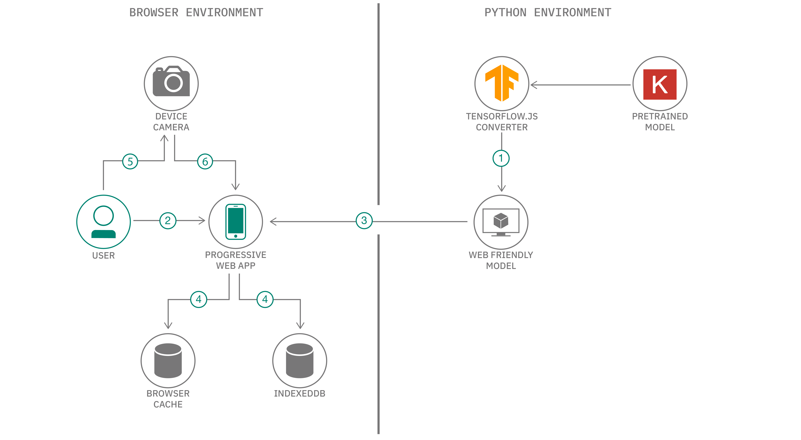
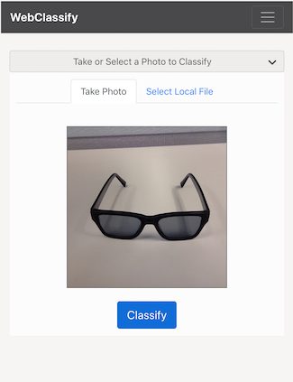
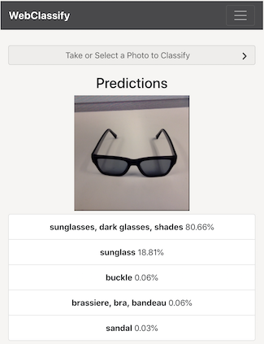

# Create a progressive web application for offline image classification

After creating deep learning models, users typically want to deploy their trained models to be used
in their applications. There are several ways to do this, and how users do it depends largely on
their use cases and requirements. One such requirement is the ability to run a model offline in
areas where Internet connectivity may be sparse or nonexistent. To do this, one solution is to
create native apps for mobile platforms which will package and load a compressed version of their
models. However, this has the overhead of needing developers with expertise in Android and iOS
development.

Here, we go over an alternative, easier way to satisfy this offline mobile
requirement by
creating a [progressive web application](https://developers.google.com/web/progressive-web-apps/)
with our model using React and TensorFlow.js. Progressive web applications (PWAs) give a native
app-like feel and can run on most modern web browsers. This makes cross-platform development much
easier as the application only has to be developed once in HTML/JavaScript. Furthermore, through
the use of [service workers](https://developers.google.com/web/fundamentals/primers/service-workers/),
PWAs can provide fully offline functionality.

With [TensorFlow.js](https://www.tensorflow.org/js), we can convert our pre-trained TensorFlow or
Keras models into JavaScript to be run in the browser through the app!

In then end, we will have a cross-platform application where users can classify
images selected locally or taken with their device's camera. The app uses TensorFlow.js and a
pre-trained model converted to the TensorFlow.js format to provide the inference capabilities.
This model is saved locally in the browser using IndexedDB, and a service worker is used to
provide offline capabilities.



## Flow

1. A pre-trained Keras/TensorFlow model is converted to the TensorFlow.js web friendly format and
   integrated with app.
2. User launches progressive web application.
3. App assets and TensorFlow.js model files are downloaded from the web.
4. Assets and model are stored locally using browser cache and IndexedDB storage.
5. User takes photo with device camera or selects local image.
6. Image is sent through the model for inference and top predictions are given.


## Included Components

* [React](https://reactjs.org/): A JavaScript library for building user interfaces.
* [TensorFlow.js](https://js.tensorflow.org/): A JavaScript library for training and deploying ML
   models in the browser and on Node.js.

## Featured Technologies

* [Deep Learning](https://developer.ibm.com/technologies/deep-learning/): Subset of AI that uses
  multi-layers neural networks that learn from lots of data.
* [Mobile](https://developer.ibm.com/technologies/mobile/): An environment to
 develop apps and enable engagements that are designed specifically for mobile
 users.
* [Web Development](https://developer.ibm.com/technologies/web-development/): The construction of
  modern web apps using open-standards technologies.
* [Visual Recognition](https://developer.ibm.com/technologies/vision/): Tag, classify, and train
  visual content using machine learning.

## Key Concepts

**Data remains on-device and classification is performed locally**<br />
No image is ever uploaded to the server because with TensorFlow.js, inference is done locally, and
user data is kept private. There is no need for a persistent network connection to continue performing inferences.

**Assets are stored in browser cache and storage**<br />
On the user's first visit, a service worker is used to cache page resources (i.e. HTML, CSS, and JS files).
Each device must have network connectivity for this first visit, but on subsequent visits, the app
will still load and work as assets will be served from the cache. Similarly on the first visit,
the pre-trained model is downloaded and saved in [IndexedDB](https://developer.mozilla.org/en-US/docs/Web/API/IndexedDB_API),
a browser API for client-side storage. Subsequent loads to the page will retrieve the model from IndexedDB if
it is available. This saves from having to continually re-download the model.

**App can run on desktop and be 'installed' on mobile**<br />
Regardless of what platform the user is on, as long as the app is run on a modern browser, everything
should work. With the use of our [manifest file](https://developers.google.com/web/fundamentals/web-app-manifest/),
the app can be 'installed' on mobile devices, making it look like a native app with its own app icon
on the home screen.

**Content can still be updated by prompting the user**<br />
Since content is served cache/storage first, we need a way to serve new content to the end-user.
For this, when new content is available a new service worker is ready to be installed, the user is
notified with a prompt to reload the page and get the latest changes. For updating the
pre-trained model, we use a server API endpoint to query the date the model on the server was last
updated. If the app can hit the endpoint and detects the locally saved model is older than the model on
the server, the user is given a prompt with the option to update.

## Watch the Video

[](https://youtu.be/DmlI0Dlr6iQ)

## Steps

1. [Clone the repo](#1-clone-the-repo)
2. [Install app dependencies](#2-install-app-dependencies)
3. [Download and convert pre-trained model](#3-download-and-convert-pre-trained-model)
4. [Setup configuration files](#4-setup-configuration-files)
5. [Deploy app and classify](#5-deploy-app-and-classify)


### 1. Clone the repo

Clone the `tfjs-web-app` locally. In a terminal, run:

```
git clone https://github.com/pvaneck/tfjs-web-app
```

Now go to the cloned repo directory:

```
cd tfjs-web-app
```


### 2. Install app dependencies

In the project directory, run:

```
yarn install
```

> **Note**: If you don't have yarn installed, instructions can be found
  [here](https://yarnpkg.com/lang/en/docs/install/). You can alternatively use `npm`.

### 3. Download and convert pre-trained model

For this pattern, we are going to download a MobileNet model. However, any image
classification model can be used including any custom made ones. You just have to be able to
convert it with `tfjs-converter`.

The `tfjs-converter` library can convert models that are in formats such as TensorFlow SavedModel and Keras
HDF5. More information about converting Python models to a web-friendly format can be found
in the `tfjs-converter` [repository](https://github.com/tensorflow/tfjs/tree/master/tfjs-converter).

Now, let's get our environment set up to use the `tensorflowjs` Python package.

The general recommendation for Python development is to use a virtual environment
[(venv)](https://docs.python.org/3/tutorial/venv.html). To install and initialize a virtual environment,
use the `venv` module on Python 3 (you install the virtualenv library for Python 2.7):

```bash
# Create the virtual environment using Python. Use one of the two commands depending on your Python version.
# Note, it may be named python3 on your system.

$ python -m venv myenv       # Python 3.X
$ virtualenv myenv           # Python 2.X

# Now source the virtual environment. Use one of the two commands depending on your OS.

$ source myenv/bin/activate  # Mac or Linux
$ ./myenv/Scripts/activate   # Windows PowerShell
```

Install the `tensorflowjs` package.
```bash
pip install tensorflowjs
```

Now let's download the Keras MobileNet model. A simple script has been provided to make sure
that MobileNet is downloaded in the proper HDF5 format. Just run:
```bash
python download_model.py
```

After this is complete, the current directory should now contain `mobilenet-model.h5`. Let's convert
it so it can be used in our app:
```bash
tensorflowjs_converter --input_format=keras ./mobilenet-model.h5 ./my-model
```

We now have a `model.json` file and multiple sharded binary files located in `./my-model` that we
will use in our web app.

### 4. Setup configuration files

In the `public` folder, you will see a `model` folder. The TensorFlow.js model files need to go there
(i.e. the `model.json` and `*shard*` files). If not already there, let's move them:
```bash
mv ./my-model/* ./public/model/
```

In `src/model`, there is a `classes.js` file which lists the possible classes that the model can classify
for. Since we used a MobileNet model which was trained using ImageNet, we will use the ImageNet
classes. You can alter this to fit your model if it is different.

If deploying the application, change the `API_ENDPOINT` in `src/config.js` to the proper endpoint.
For development and local testing, leave it as is.

### 5. Deploy app and classify

You can either deploy in development mode or production mode. Service workers and offline usage
will only work if you deploy the app in production mode.

#### Development Mode

In the project directory, run:

```
yarn start-dev
```

Runs the app in the development mode.<br />
Open [http://localhost:3000](http://localhost:3000) to view it in the browser.

The page will reload if you make edits to the UI. You will also see any lint errors in the console.

The API server is hosted on `http://localhost:5000` by default.

#### Production Mode

In the project directory, run:

```
yarn build
```

Builds the app for production to the `build` folder. It correctly bundles React in production mode
and optimizes the build for the best performance.

The build is minified and the filenames include the hashes.

Since we use Node.js to deploy the app, simply run:

```
node server.js
```

This will bring up the server which will serve both the API and built UI code.
Visit it at `http://localhost:5000`.

**Note**: Since the production app uses a service worker, assets are served from the cache first. A
notification should appear on the web page when changes (new builds) are detected, prompting you to reload.
However, if you still don't see your changes after reloading, try ensuring all tabs of the app
in the browser are closed completely to prompt an update of the code when you revisit the page.

#### Other Information

To prompt the browser to download a new model if one is available, the app queries a simple endpoint
`/api/model_info` from the server. This endpoint provides the date the model was last updated as provided by
`model_info.txt`. This can be changed to other means of assessing model versions, but is deliberately
kept simple here. This can be updated with `date > model_info.txt`. If the date of the app's
locally stored model is before this date, a prompt is given to user with the option to update the model.
The user can choose to dismiss the update, or if the API call fails, then the locally saved model will
continue to be used.

#### Deploy on IBM Cloud

Deployment of the production app on the IBM Cloud is easy. Instructions can be found [here](doc/cloud-deploy.md).

#### Using the App

The app allows you to either use your device's camera to snap an image or select a local image from
the device's filesystem. Select an image of an object or put the object in frame using your camera,
then click classify. Local inference will then be performed, and the top five results will be given.




## Links

* [TensorFlow.js](https://www.tensorflow.org/js)
* [React](https://reactjs.org/)
* [Progressive Web Apps](https://developers.google.com/web/progressive-web-apps/)
* [Service Workers](https://developer.mozilla.org/en-US/docs/Web/API/Service_Worker_API)
* [Web App Manifest](https://developers.google.com/web/fundamentals/web-app-manifest/)
* [IndexedDB](https://developer.mozilla.org/en-US/docs/Web/API/IndexedDB_API)
* [React Bootstrap](https://react-bootstrap.github.io/)

## License

This code pattern is licensed under the Apache Software License, Version 2.  Separate third party code objects invoked within this code pattern are licensed by their respective providers pursuant to their own separate licenses. Contributions are subject to the [Developer Certificate of Origin, Version 1.1 (DCO)](https://developercertificate.org/) and the [Apache Software License, Version 2](https://www.apache.org/licenses/LICENSE-2.0.txt).

[Apache Software License (ASL) FAQ](https://www.apache.org/foundation/license-faq.html#WhatDoesItMEAN)
